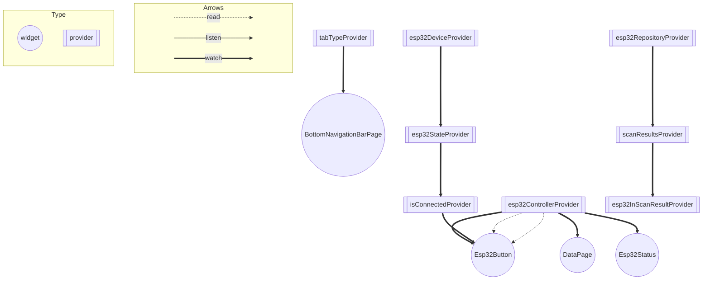

# esp32flutter_sample

ESP32とBLE通信を行うサンプルアプリ

## Riverpod Graph

Generated by https://github.com/rrousselGit/riverpod/tree/master/packages/riverpod_graph

```mermaid
flowchart TB
  subgraph Arrows
    direction LR
    start1[ ] -..->|read| stop1[ ]
    style start1 height:0px;
    style stop1 height:0px;
    start2[ ] --->|listen| stop2[ ]
    style start2 height:0px;
    style stop2 height:0px;
    start3[ ] ===>|watch| stop3[ ]
    style start3 height:0px;
    style stop3 height:0px;
  end

  subgraph Type
    direction TB
    ConsumerWidget((widget));
    Provider[[provider]];
  end
  DataPage((DataPage));
  esp32ControllerProvider ==> DataPage;
  BottomNavigationBarPage((BottomNavigationBarPage));
  tabTypeProvider ==> BottomNavigationBarPage;
  Esp32Button((Esp32Button));
  esp32ControllerProvider ==> Esp32Button;
  isConnectedProvider ==> Esp32Button;
  esp32ControllerProvider -.-> Esp32Button;
  esp32ControllerProvider -.-> Esp32Button;
  Esp32Status((Esp32Status));
  esp32ControllerProvider ==> Esp32Status;
  scanResultsProvider[[scanResultsProvider]];
  esp32RepositoryProvider ==> scanResultsProvider;
  esp32RepositoryProvider[[esp32RepositoryProvider]];
  esp32InScanResultProvider[[esp32InScanResultProvider]];
  scanResultsProvider ==> esp32InScanResultProvider;
  esp32StateProvider[[esp32StateProvider]];
  esp32DeviceProvider ==> esp32StateProvider;
  esp32DeviceProvider[[esp32DeviceProvider]];
  isConnectedProvider[[isConnectedProvider]];
  esp32StateProvider ==> isConnectedProvider;
  esp32ControllerProvider[[esp32ControllerProvider]];
  tabTypeProvider[[tabTypeProvider]];
```